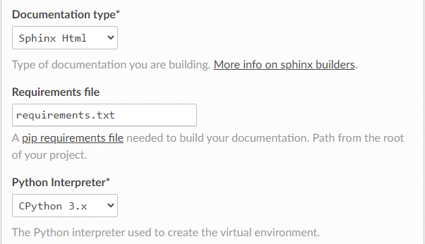

# Sign up for Read the Docs

To sign up for a Read the Docs account, navigate to the `Sign Up page` and choose the option `Sign up with GitHub`. On the authorization page, click the green `Authorize readthedocs` button.

After that, you will be redirected to Read the Docs, where you will need to confirm your e-mail and username.

To upload the project see [Importing the project to Read the Docs](https://docs.readthedocs.io/en/stable/tutorial/#importing-the-project-to-read-the-docs).

After uploading the project your build will fail, Create a `requirements.txt` file and go to the advanced settings and add your  `requirements.txt` file.

The project is done, enjoy.
